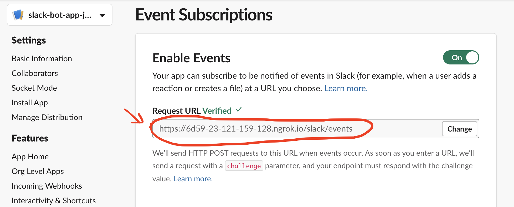
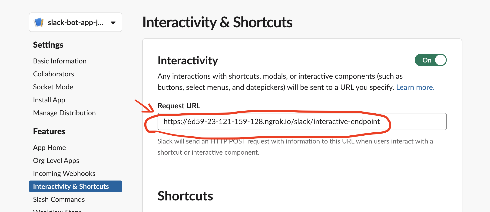

[](https://github.com/pujunru/slackathon/actions/workflows/pipeline.yaml)
# Slackathon

## Setup
Make sure you have python 3.8 installed. 

Created a virtualenv and install the required packages.
```bash
python -m venv .venv
source .venv/bin/activate
pip install -r bot/requirements.txt -r requirements-dev.txt
```

## Start Slack Bolt App
Activate your python venv and run the following commands
```bash
python bot/app.py
```
which will start a flask server on port 3000 and forwarding Slack traffic to the slack handlers.


###Start ngrok tunnel
```bash
ngrok http 3000
```
Then configure Slack app with the ngrok https endpoint:

